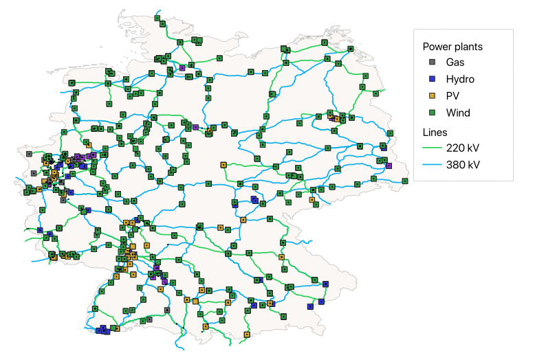
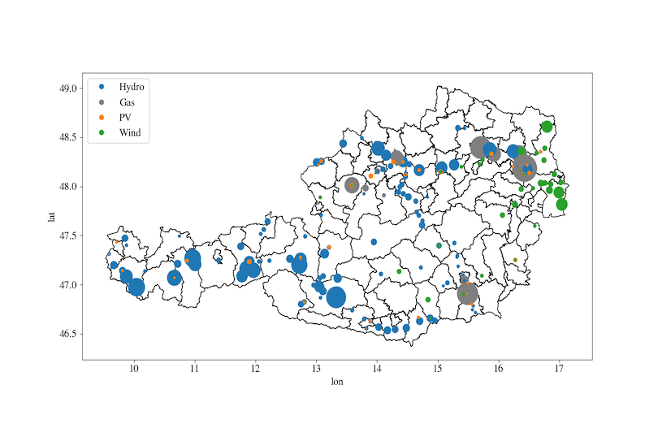

# Transmission-Grid-Generator (TGG)

The Transmission Grid Generator creates an up-to-date topological model of an electrical transmission network using open-source data from the OpenStreetMaps database. It uses Python to create a set of CSV files containing data of the main physical elements of the grid (power lines, substations, power plants and transformers).

## Purpose

TGG is intended to serve as a tool to create a first topological structure of a more complete power grid model, which can be used for power system studies. The implemented algorithms aim to create a fully connected network where the data of its elements is coherent. However, due to the nature of open-source data, it is not possible to guarantee that this is always true.

## Getting started

- Clone the repository and install the requirements:

  ```bash
  conda env create -f environment.yml
  ```

- Select the area and date for which the transmission grid data will be queried. To do so, modify the *****query_area_tag***** and *****query_date***** variables from ````main.py```` accordingly.


- Download and place a file named *area_geometry.geojson* with the geometry for the queried area in the *raw_data* folder. Steps to download the geometry file:
    1) Look for the OSM relation id of the selected area using [Nominatim](https://nominatim.openstreetmap.org/ui/search.html). For example, for Germany, the id is 51477.
    2) Use [overpass turbo](https://overpass-turbo.eu/) to run the following query (where *****relation_id***** is 51477 for the example of Germany):
        ````
        [out:json];
        relation(relation_id);
        out body geom;
        ````
    3) Export the data as a GeoJSON and rename the file to *area_geometry.geojson*.


- Run ````main.py````.

## Screenshots

Representation in QGIS of the obtained model for Germany.


Distribution of power plants weighted by their capacity in Austria.


## Project tree

```
📦austrian-grid
 ┣ 📂examples
 ┃ ┣ 📂austrian_transmission_grid
 ┃ ┗ 📂german_transmission_grid
 ┣ 📂data_generator
 ┣ 📂docs
 ┣ 📜environment.yml
 ┣ 📜LICENSE.md
 ┗ 📜README.md
```

where:
 * **data_generator**: is a python package containing the code used to prepare the data for a general power grid
 * **examples**: folder containing examples of grid models created with the grid generator
 * **docs**: folder for project documentation (Sphinx)

